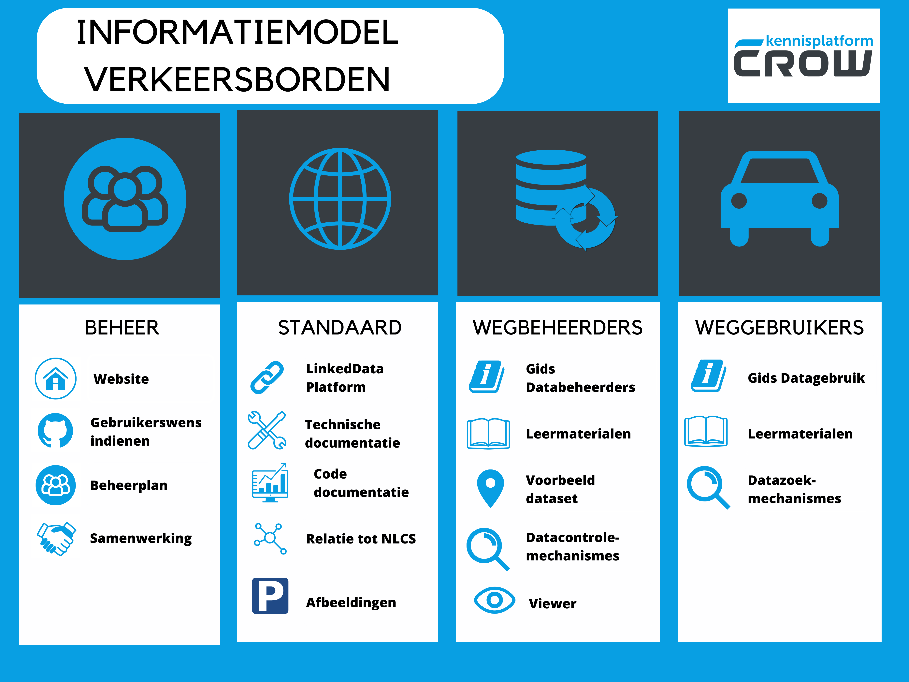

# Informatiemodel Verkeerstekens en verkeersbesluiten

Het Ministerie van Infrastructuur en Waterstaat heeft CROW gevraagd om een Informatiemodel Verkeerstekens op te stellen, met als doel bij het weggennetwerk verkeersregels en -borden te kunnen publiceren ten behoeve van SMART mobility systemen. 

<figure>

<figcaption>Beschikbare middelen bij het informatiemodel</caption>
</figure>

## Context
De context, doelen, use cases en uitgangspunten van het informatiemodel staan in het [Architectuur Framework](https://docs.crow.nl/verkeersborden/framework).

## Open beheer conform BOMOS
* De website komt beschikbaar bij definitieve publicatie.
* Het [Beheerplan](https://docs.crow.nl/verkeersborden/beheerplan) beschrijft het beheer van het informatiemodel als open standaard. Voor de beheerder van het Informatiemodel is er een [Beheerhandleiding](https://docs.crow.nl/verkeersborden/managementmanual).
* Met [GitHub issues](https://github.com/Stichting-CROW/verkeersborden/issues) kunnen gebruikers van het informatiemodel verzoeken om opheldering van de documentatie of om wijzigingen in het informatiemodel vragen.
* Gebruikers kunnen bij de [helpdesk van CROW](https://www.crow.nl/ondersteuning/helpdesk) terecht voor vragen over het informatiemodel.

## Standaard

* Het informatiemodel is online beschikbaar via [SPARQL-endpoints](https://github.com/Stichting-CROW/verkeersborden/blob/main/SPARQL-endpoints.md) waar het ook kan worden gedownload als turtle. Met standaard [query's](https://github.com/Stichting-CROW/verkeersborden/tree/main/code/modelquerys) kan het informatiemodel doorzocht worden.  Voor mensen is er een [viewer](https://crow.wistor.nl/projects/Test/XuQYW/) om het informatiemodel te bekijken, en een viewer met [standaard Fysieke Platen](https://docs.crow.nl/verkeersborden/standardplates/).
* De [Technische documentatie](https://docs.crow.nl/verkeersborden/technicaldocs) bevat de onderbouwing van de technische uitwerking van het informatiemodel. 
* Zie voor de [svg's van verkeersborden](https://github.com/Stichting-CROW/verkeersborden/edit/main/images), met doorverwijzing naar NDW en NLCS in de [ReadME](https://github.com/Stichting-CROW/verkeersborden/edit/main/images/ReadME).
* Een vertaling naar veel voorkomende standaard fysieke platen (fysieke verkeersborden met gekleurde achtergrondschilden, iconen van verkeersborden, onderborden en teksten) zoals men die buiten tegenkomt, en die in NLCS of IMBOR zijn opgenomen, is nog niet uitgewerkt voor de concept 1.0 versie.

### Gebruikersondersteuning 
De gebruikersondersteuning is geschreven met als aanname, dat de verkeerskundige informatie federatief gedeeld wordt, waarbij de wegbeheerder verkeerskundige informatie federatief deelt op basis van het informatiemodel, en de landelijke registratie de samenhang en kwaliteit van de informatie op landelijk niveau bewaakt. Dit is toekomstmuziek, er zal nog een heel ontwikkeltraject van de landelijke registratie (en bij wegbeheerders) moeten plaatsvinden voordat het zover is. Daarom is deze documentatie nog heel summier, en gericht op gebruikers met technische kennis op het gebied van code lezen en schrijven, en voor softwareontwikkelaars.

#### Voor databeheerders
Databeheerders worden op weg geholpen met:

* De [Gids voor databeheer](https://docs.crow.nl/verkeersborden/howtodatamanagement) beschrijft het samenstellen en beheren van verkeerskundige informatie op basis van het informatiemodel.
* In de [Leermaterialen voor assetdatabeheerders en wegbeheerders, nog niet uitgewerkt](https://docs.crow.nl/verkeersborden/datamanagementguide) wordt de weg(data-)beheerder ondersteund bij het leren door oefeningen. Daarbij horen [voorbeelddatasets, nog niet uitgewerkt](https://github.com/Stichting-CROW/verkeersborden/tree/main/exampledatasets) en [controlemechanismes, nog niet uitgewerkt](https://github.com/Stichting-CROW/verkeersborden/tree/main/code/datachecks) (kwaliteitstoetsen datasets).

#### Voor datagebruikers
* [Gids voor datagebruik](https://docs.crow.nl/verkeersborden/howtousedata): toelichting op de logica van het informatiemodel en hoe de verkeerskundige informatie kan worden doorzocht met de beschikbare zoekmechanismes ([SPARQL queries nog niet uitgewerkt]())
* In  de [Leermaterialen voor ontwikkelaars, nog niet uitgewerkt](https://docs.crow.nl/verkeersborden/datauserguide) wordt de datagebruiker ondersteund bij het leren door oefeningen. Daarbij horen [voorbeelddatasets, nog niet uitgewerkt](https://github.com/Stichting-CROW/verkeersborden/tree/main/exampledatasets) en [zoekmechanismes, nog niet uitgewerkt](https://github.com/Stichting-CROW/verkeersborden/tree/main/code/dataquerys) voor het zoeken naar actuele verkeersmaatregelen en verkeersborden.
