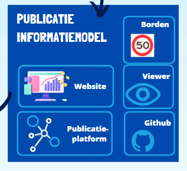
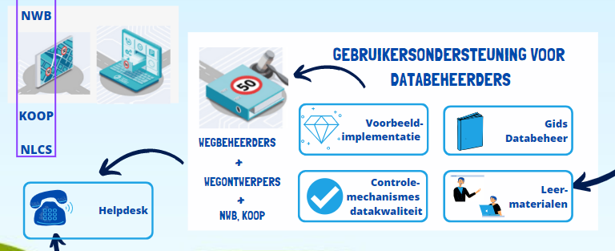

# Informatiemodel Verkeerstekens en verkeersbesluiten

Het Ministerie van Infrastructuur en Waterstaat heeft CROW gevraagd om een Informatiemodel Verkeerstekens op te stellen, met als doel bij het weggennetwerk verkeersregels en -borden te kunnen publiceren ten behoeve van SMART mobility systemen.

## Context
De context en uitgangspunten van het informatiemodel staan in het  [Architectuur Framework](https://docs.crow.nl/verkeersborden/framework).

<figure>

<figcaption>Beschikbare middelen bij het informatiemodel</caption>
</figure>

## Beheer

* Het [Beheerplan](https://docs.crow.nl/verkeersborden/beheerplan) beschrijft het strategische beheer en de beheerorganisatie, met verdere uitwerking naar tactische en operationele invulling van het beheer. Voor de beheerder van het Informatiemodel is er een [Beheerhandleiding](https://docs.crow.nl/verkeersborden/managementmanual).
* Met [GitHub issues](https://github.com/Stichting-CROW/verkeersborden/issues) kunnen gebruikers van het informatiemodel verzoeken om opheldering van de documentatie of om wijzigingen in het informatiemodel vragen. 
* De [Technische documentatie](https://docs.crow.nl/verkeersborden/technicaldocs) bevat de onderbouwing van de technische uitwerking van het informatiemodel. 

### Publicatie
<figure>

<figcaption>De publicatie van het informatiemodel</caption>
</figure>

* Een webpagina wordt ingericht met informatie over het doel en de samenwerkingsverbanden rondom het informatiemodel.
* Voor rechtstreeks vanuit systemen of het internet zoeken in het informatiemodel wordt deze gepubliceerd op het SPARQL-endpoint van crow:  
* De afbeeldingen in svg formaat zijn te vinden op de volgende locaties: het NDW publiceert de [iconen met verkeersborden uit de RVV1990](https://github.com/ndwnu/qgis-verkeersborden-style), CROW publiceert de [overige iconen](https://github.com/Stichting-CROW/verkeersborden/edit/main/images), die nog niet beschikbaar zijn bij de andere bronnen, NLCS publiceert de [Standaard fysieke platen, concept NLCS 5.1](https://github.com/nl-digigo/NLCS/tree/main/symbolen/concept/5.1/svg)
* Er komt een techische viewer van het informatiemodel beschikbaar voor databeheerders en datagebruikers.
* Voor het verkennen van het informatiemodel en sommige toepassingen kan het handig zijn om de code rechtstreeks te kunnen inzien en downloaden, daarom wordt het informatiemodel samen met de andere code op de Github_Verkeersborden omgeving geplaatst in het Turtle formaat:
> "Terse RDF Triple Language", een bestandsformaat (Informatie technologie) ([Bron:Wikipedia](https://nl.wikipedia.org/wiki/Turtle_(syntaxis))). Turtle is een serialisatieformaat voor het Resource Description Framework (RDF), een universele taal ("Linked Data") voor het weergeven van informatie op het Web.

### Gebruikersondersteuning databeheerders

<figure>

<figcaption>Gebruikersondersteuning databeheerders</caption>
</figure>

Databeheerders worden op weg geholpen met:

* [Gids voor databeheer](https://docs.crow.nl/verkeersborden/howtodatamanagement): voor wegbeheerders. In de gids voor databeheer wordt het samenstellen en beheren van verkeerskundige informatie stapsgewijs beschreven, met als doel de toepassing te ondersteunen voor beginnende gebruikers. Om op eenvoudige wijze verkeerskundige informatie te kunnen samenstellen en beheren, is een applicatie nodig die het geheel beter visueel ondersteunt. Dat is buiten de scope van het informatiemodel. Daarom is deze gids geschikt voor databeheerders met technische kennis op het gebied van code lezen en schrijven, en voor softwareontwikkelaars.
* [Leermaterialen voor assetdatabeheerders en wegbeheerders](https://docs.crow.nl/verkeersborden/datamanagementguide). In de leermaterialen wordt het samenstellen en beheren van verkeerskundige informatie op educatief verantwoorde wijze uitgelegd, met als leerdoel het begrijpen en kunnen uitleggen hoe je verkeerskundige informatie samenstelt. De gebruiker wordt ondersteund bij het leren door oefeningen. Doel is om een databeheerder met technische kennis op weg te helpen.
* Een voorbeeld-implementatie (dataset). De voorbeeld-implementatie bestaat uit een dataset waarin het informatiemodel is toegepast op een (fictief) verkeerskundig wegennetwerk, met bijbehorende kaartvisualisaties van de wegen, zones, routes en fysiek aanwezige verkeersborden. In de voorbeeld dataset zitten gebreken (niet actueel / betrouwbaar / compleet), die met de controlemeachnismes gevonden kunnen worden.
* Controlemechanismes (kwaliteitstoetsen dataset). De controlemechanismes voor de verkeerskundige informatie bestaan uit SPARQL queries waarmee onderzocht kan worden of de verkeerskundige informatie voldoet aan de regels van het informatiemodel. 

Daarnaast kunnen databeheerders bij de [helpdesk van CROW](https://www.crow.nl/ondersteuning/helpdesk) terecht voor vragen over het informatiemodel. 

### Gebruikersondersteuning datagebruikers
De gebruikersondersteuning is geschreven met als aanname, dat de verkeerskundige informatie als linked data gepubliceerd wordt, op basis van het informatiemodel. Dit is toekomstmuziek, er zal nog een heel ontwikkeltraject van de landelijke registratie (en bij wergbeheerders) moeten plaatsvinden voordat het zover is. Daarom is deze documentatie nog heel summier.

* [Gids voor datagebruik](https://docs.crow.nl/verkeersborden/howtousedata): toelichting op de logica van het informatiemodel en hoe de verkeerskundige informatie kan worden doorzocht met de beschikbare Zoekmechanismes ([SPARQL queries]())
* [Leermaterialen voor ontwikkelaars](datauserguide). In de leermaterialen wordt de gebruiker ondersteund bij het leren door oefeningen. 
